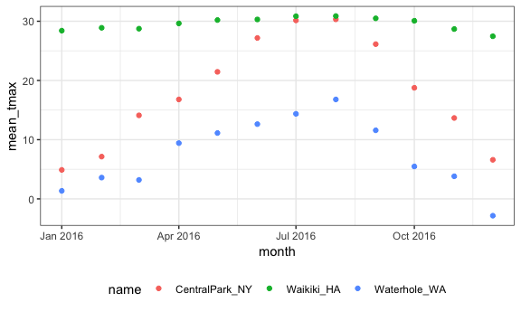
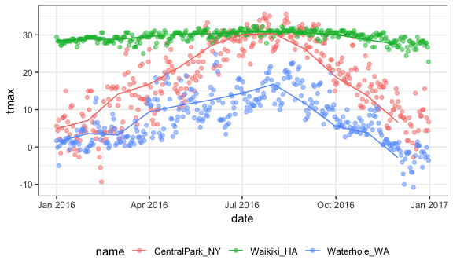
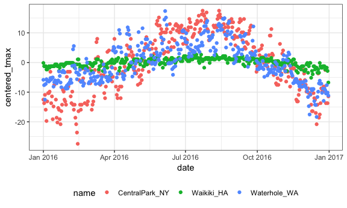

EDA
================
Xue Yang
10/04/2018

``` r
library(tidyverse)
```

    ## -- Attaching packages ---------------------------------------- tidyverse 1.2.1 --

    ## <U+221A> ggplot2 3.0.0     <U+221A> purrr   0.2.5
    ## <U+221A> tibble  1.4.2     <U+221A> dplyr   0.7.6
    ## <U+221A> tidyr   0.8.1     <U+221A> stringr 1.3.1
    ## <U+221A> readr   1.1.1     <U+221A> forcats 0.3.0

    ## -- Conflicts ------------------------------------------- tidyverse_conflicts() --
    ## x dplyr::filter() masks stats::filter()
    ## x dplyr::lag()    masks stats::lag()

``` r
knitr::opts_chunk$set(
  fig.width = 6,
  fig.asp = .6,
  out.width = "90%"
)

theme_set(theme_bw() + theme(legend.position = "bottom"))
```

``` r
library(rnoaa)

weather_df = 
  rnoaa::meteo_pull_monitors(c("USW00094728", "USC00519397", "USS0023B17S"),
                      var = c("PRCP", "TMIN", "TMAX"), 
                      date_min = "2016-01-01",
                      date_max = "2016-12-31") %>%
  mutate(
    name = recode(id, USW00094728 = "CentralPark_NY", 
                      USC00519397 = "Waikiki_HA",
                      USS0023B17S = "Waterhole_WA"),
    tmin = tmin / 10,
    tmax = tmax / 10,
    month = lubridate::floor_date(date, unit = "month")) %>%
  select(name, id, date, month, everything())
weather_df
```

    ## # A tibble: 1,098 x 7
    ##    name           id          date       month       prcp  tmax  tmin
    ##    <chr>          <chr>       <date>     <date>     <dbl> <dbl> <dbl>
    ##  1 CentralPark_NY USW00094728 2016-01-01 2016-01-01     0   5.6   1.1
    ##  2 CentralPark_NY USW00094728 2016-01-02 2016-01-01     0   4.4   0  
    ##  3 CentralPark_NY USW00094728 2016-01-03 2016-01-01     0   7.2   1.7
    ##  4 CentralPark_NY USW00094728 2016-01-04 2016-01-01     0   2.2  -9.9
    ##  5 CentralPark_NY USW00094728 2016-01-05 2016-01-01     0  -1.6 -11.6
    ##  6 CentralPark_NY USW00094728 2016-01-06 2016-01-01     0   5    -3.8
    ##  7 CentralPark_NY USW00094728 2016-01-07 2016-01-01     0   7.8  -0.5
    ##  8 CentralPark_NY USW00094728 2016-01-08 2016-01-01     0   7.8  -0.5
    ##  9 CentralPark_NY USW00094728 2016-01-09 2016-01-01     0   8.3   4.4
    ## 10 CentralPark_NY USW00094728 2016-01-10 2016-01-01   457  15     4.4
    ## # ... with 1,088 more rows

Start grouping
--------------

``` r
weather_df %>% 
  group_by(name)
```

    ## # A tibble: 1,098 x 7
    ## # Groups:   name [3]
    ##    name           id          date       month       prcp  tmax  tmin
    ##    <chr>          <chr>       <date>     <date>     <dbl> <dbl> <dbl>
    ##  1 CentralPark_NY USW00094728 2016-01-01 2016-01-01     0   5.6   1.1
    ##  2 CentralPark_NY USW00094728 2016-01-02 2016-01-01     0   4.4   0  
    ##  3 CentralPark_NY USW00094728 2016-01-03 2016-01-01     0   7.2   1.7
    ##  4 CentralPark_NY USW00094728 2016-01-04 2016-01-01     0   2.2  -9.9
    ##  5 CentralPark_NY USW00094728 2016-01-05 2016-01-01     0  -1.6 -11.6
    ##  6 CentralPark_NY USW00094728 2016-01-06 2016-01-01     0   5    -3.8
    ##  7 CentralPark_NY USW00094728 2016-01-07 2016-01-01     0   7.8  -0.5
    ##  8 CentralPark_NY USW00094728 2016-01-08 2016-01-01     0   7.8  -0.5
    ##  9 CentralPark_NY USW00094728 2016-01-09 2016-01-01     0   8.3   4.4
    ## 10 CentralPark_NY USW00094728 2016-01-10 2016-01-01   457  15     4.4
    ## # ... with 1,088 more rows

``` r
weather_df %>% 
  group_by(month)
```

    ## # A tibble: 1,098 x 7
    ## # Groups:   month [12]
    ##    name           id          date       month       prcp  tmax  tmin
    ##    <chr>          <chr>       <date>     <date>     <dbl> <dbl> <dbl>
    ##  1 CentralPark_NY USW00094728 2016-01-01 2016-01-01     0   5.6   1.1
    ##  2 CentralPark_NY USW00094728 2016-01-02 2016-01-01     0   4.4   0  
    ##  3 CentralPark_NY USW00094728 2016-01-03 2016-01-01     0   7.2   1.7
    ##  4 CentralPark_NY USW00094728 2016-01-04 2016-01-01     0   2.2  -9.9
    ##  5 CentralPark_NY USW00094728 2016-01-05 2016-01-01     0  -1.6 -11.6
    ##  6 CentralPark_NY USW00094728 2016-01-06 2016-01-01     0   5    -3.8
    ##  7 CentralPark_NY USW00094728 2016-01-07 2016-01-01     0   7.8  -0.5
    ##  8 CentralPark_NY USW00094728 2016-01-08 2016-01-01     0   7.8  -0.5
    ##  9 CentralPark_NY USW00094728 2016-01-09 2016-01-01     0   8.3   4.4
    ## 10 CentralPark_NY USW00094728 2016-01-10 2016-01-01   457  15     4.4
    ## # ... with 1,088 more rows

``` r
weather_df %>% 
  group_by(name, month)
```

    ## # A tibble: 1,098 x 7
    ## # Groups:   name, month [36]
    ##    name           id          date       month       prcp  tmax  tmin
    ##    <chr>          <chr>       <date>     <date>     <dbl> <dbl> <dbl>
    ##  1 CentralPark_NY USW00094728 2016-01-01 2016-01-01     0   5.6   1.1
    ##  2 CentralPark_NY USW00094728 2016-01-02 2016-01-01     0   4.4   0  
    ##  3 CentralPark_NY USW00094728 2016-01-03 2016-01-01     0   7.2   1.7
    ##  4 CentralPark_NY USW00094728 2016-01-04 2016-01-01     0   2.2  -9.9
    ##  5 CentralPark_NY USW00094728 2016-01-05 2016-01-01     0  -1.6 -11.6
    ##  6 CentralPark_NY USW00094728 2016-01-06 2016-01-01     0   5    -3.8
    ##  7 CentralPark_NY USW00094728 2016-01-07 2016-01-01     0   7.8  -0.5
    ##  8 CentralPark_NY USW00094728 2016-01-08 2016-01-01     0   7.8  -0.5
    ##  9 CentralPark_NY USW00094728 2016-01-09 2016-01-01     0   8.3   4.4
    ## 10 CentralPark_NY USW00094728 2016-01-10 2016-01-01   457  15     4.4
    ## # ... with 1,088 more rows

``` r
weather_df %>% 
  group_by(name, month) %>% 
  ungroup() # nothing will change
```

    ## # A tibble: 1,098 x 7
    ##    name           id          date       month       prcp  tmax  tmin
    ##    <chr>          <chr>       <date>     <date>     <dbl> <dbl> <dbl>
    ##  1 CentralPark_NY USW00094728 2016-01-01 2016-01-01     0   5.6   1.1
    ##  2 CentralPark_NY USW00094728 2016-01-02 2016-01-01     0   4.4   0  
    ##  3 CentralPark_NY USW00094728 2016-01-03 2016-01-01     0   7.2   1.7
    ##  4 CentralPark_NY USW00094728 2016-01-04 2016-01-01     0   2.2  -9.9
    ##  5 CentralPark_NY USW00094728 2016-01-05 2016-01-01     0  -1.6 -11.6
    ##  6 CentralPark_NY USW00094728 2016-01-06 2016-01-01     0   5    -3.8
    ##  7 CentralPark_NY USW00094728 2016-01-07 2016-01-01     0   7.8  -0.5
    ##  8 CentralPark_NY USW00094728 2016-01-08 2016-01-01     0   7.8  -0.5
    ##  9 CentralPark_NY USW00094728 2016-01-09 2016-01-01     0   8.3   4.4
    ## 10 CentralPark_NY USW00094728 2016-01-10 2016-01-01   457  15     4.4
    ## # ... with 1,088 more rows

Count frist ...

``` r
weather_df %>% 
  group_by(name, month) %>% 
  summarize(number = n()) # summary how many elements are in the group
```

    ## # A tibble: 36 x 3
    ## # Groups:   name [?]
    ##    name           month      number
    ##    <chr>          <date>      <int>
    ##  1 CentralPark_NY 2016-01-01     31
    ##  2 CentralPark_NY 2016-02-01     29
    ##  3 CentralPark_NY 2016-03-01     31
    ##  4 CentralPark_NY 2016-04-01     30
    ##  5 CentralPark_NY 2016-05-01     31
    ##  6 CentralPark_NY 2016-06-01     30
    ##  7 CentralPark_NY 2016-07-01     31
    ##  8 CentralPark_NY 2016-08-01     31
    ##  9 CentralPark_NY 2016-09-01     30
    ## 10 CentralPark_NY 2016-10-01     31
    ## # ... with 26 more rows

``` r
weather_df %>% 
  group_by(name) %>% 
  summarize(number = n()) 
```

    ## # A tibble: 3 x 2
    ##   name           number
    ##   <chr>           <int>
    ## 1 CentralPark_NY    366
    ## 2 Waikiki_HA        366
    ## 3 Waterhole_WA      366

``` r
weather_df %>% 
  group_by(month) %>% 
  summarize(number = n())
```

    ## # A tibble: 12 x 2
    ##    month      number
    ##    <date>      <int>
    ##  1 2016-01-01     93
    ##  2 2016-02-01     87
    ##  3 2016-03-01     93
    ##  4 2016-04-01     90
    ##  5 2016-05-01     93
    ##  6 2016-06-01     90
    ##  7 2016-07-01     93
    ##  8 2016-08-01     93
    ##  9 2016-09-01     90
    ## 10 2016-10-01     93
    ## 11 2016-11-01     90
    ## 12 2016-12-01     93

``` r
weather_df %>% 
  count(month) # count do the same thing as (group_by + summarize)
```

    ## # A tibble: 12 x 2
    ##    month          n
    ##    <date>     <int>
    ##  1 2016-01-01    93
    ##  2 2016-02-01    87
    ##  3 2016-03-01    93
    ##  4 2016-04-01    90
    ##  5 2016-05-01    93
    ##  6 2016-06-01    90
    ##  7 2016-07-01    93
    ##  8 2016-08-01    93
    ##  9 2016-09-01    90
    ## 10 2016-10-01    93
    ## 11 2016-11-01    90
    ## 12 2016-12-01    93

``` r
weather_df %>% 
  count(name, month)
```

    ## # A tibble: 36 x 3
    ##    name           month          n
    ##    <chr>          <date>     <int>
    ##  1 CentralPark_NY 2016-01-01    31
    ##  2 CentralPark_NY 2016-02-01    29
    ##  3 CentralPark_NY 2016-03-01    31
    ##  4 CentralPark_NY 2016-04-01    30
    ##  5 CentralPark_NY 2016-05-01    31
    ##  6 CentralPark_NY 2016-06-01    30
    ##  7 CentralPark_NY 2016-07-01    31
    ##  8 CentralPark_NY 2016-08-01    31
    ##  9 CentralPark_NY 2016-09-01    30
    ## 10 CentralPark_NY 2016-10-01    31
    ## # ... with 26 more rows

Grouped summaries
-----------------

``` r
weather_df %>% 
  group_by(name, month) %>% 
  summarize(number = n(),
            mean_tmax = mean(tmax)) 
```

    ## # A tibble: 36 x 4
    ## # Groups:   name [?]
    ##    name           month      number mean_tmax
    ##    <chr>          <date>      <int>     <dbl>
    ##  1 CentralPark_NY 2016-01-01     31      4.89
    ##  2 CentralPark_NY 2016-02-01     29      7.14
    ##  3 CentralPark_NY 2016-03-01     31     14.1 
    ##  4 CentralPark_NY 2016-04-01     30     16.8 
    ##  5 CentralPark_NY 2016-05-01     31     21.5 
    ##  6 CentralPark_NY 2016-06-01     30     27.2 
    ##  7 CentralPark_NY 2016-07-01     31     30.1 
    ##  8 CentralPark_NY 2016-08-01     31     30.3 
    ##  9 CentralPark_NY 2016-09-01     30     26.1 
    ## 10 CentralPark_NY 2016-10-01     31     18.8 
    ## # ... with 26 more rows

``` r
weather_df %>% 
  group_by(name, month) %>% 
  summarize(number = n(),
            name_na = sum(is.na(tmax)), # show the number of missing value
            mean_tmax = mean(tmax))
```

    ## # A tibble: 36 x 5
    ## # Groups:   name [?]
    ##    name           month      number name_na mean_tmax
    ##    <chr>          <date>      <int>   <int>     <dbl>
    ##  1 CentralPark_NY 2016-01-01     31       0      4.89
    ##  2 CentralPark_NY 2016-02-01     29       0      7.14
    ##  3 CentralPark_NY 2016-03-01     31       0     14.1 
    ##  4 CentralPark_NY 2016-04-01     30       0     16.8 
    ##  5 CentralPark_NY 2016-05-01     31       0     21.5 
    ##  6 CentralPark_NY 2016-06-01     30       0     27.2 
    ##  7 CentralPark_NY 2016-07-01     31       0     30.1 
    ##  8 CentralPark_NY 2016-08-01     31       0     30.3 
    ##  9 CentralPark_NY 2016-09-01     30       0     26.1 
    ## 10 CentralPark_NY 2016-10-01     31       0     18.8 
    ## # ... with 26 more rows

``` r
# ?mean
weather_df %>% 
  group_by(name, month) %>% 
  summarize(number = n(),
            mean_tmax = mean(tmax, na.rm = TRUE)) # no NA will be calculate
```

    ## # A tibble: 36 x 4
    ## # Groups:   name [?]
    ##    name           month      number mean_tmax
    ##    <chr>          <date>      <int>     <dbl>
    ##  1 CentralPark_NY 2016-01-01     31      4.89
    ##  2 CentralPark_NY 2016-02-01     29      7.14
    ##  3 CentralPark_NY 2016-03-01     31     14.1 
    ##  4 CentralPark_NY 2016-04-01     30     16.8 
    ##  5 CentralPark_NY 2016-05-01     31     21.5 
    ##  6 CentralPark_NY 2016-06-01     30     27.2 
    ##  7 CentralPark_NY 2016-07-01     31     30.1 
    ##  8 CentralPark_NY 2016-08-01     31     30.3 
    ##  9 CentralPark_NY 2016-09-01     30     26.1 
    ## 10 CentralPark_NY 2016-10-01     31     18.8 
    ## # ... with 26 more rows

``` r
weather_df %>% 
  group_by(name, month) %>% 
  summarize(number = n(),
            mean_tmax = mean(tmax, na.rm = TRUE),
            median_prcp = median(prcp, na.rm = TRUE)
  )
```

    ## # A tibble: 36 x 5
    ## # Groups:   name [?]
    ##    name           month      number mean_tmax median_prcp
    ##    <chr>          <date>      <int>     <dbl>       <dbl>
    ##  1 CentralPark_NY 2016-01-01     31      4.89           0
    ##  2 CentralPark_NY 2016-02-01     29      7.14           0
    ##  3 CentralPark_NY 2016-03-01     31     14.1            0
    ##  4 CentralPark_NY 2016-04-01     30     16.8            0
    ##  5 CentralPark_NY 2016-05-01     31     21.5            0
    ##  6 CentralPark_NY 2016-06-01     30     27.2            0
    ##  7 CentralPark_NY 2016-07-01     31     30.1            0
    ##  8 CentralPark_NY 2016-08-01     31     30.3            0
    ##  9 CentralPark_NY 2016-09-01     30     26.1            0
    ## 10 CentralPark_NY 2016-10-01     31     18.8            0
    ## # ... with 26 more rows

``` r
weather_df %>% 
  group_by(name, month) %>% 
  summarize(number = n(),
            mean_tmax = mean(tmax, na.rm = TRUE),
            median_prcp = median(prcp, na.rm = TRUE),
            sd_tmin = sd(tmin, na.rm = TRUE)
        
  )
```

    ## # A tibble: 36 x 6
    ## # Groups:   name [?]
    ##    name           month      number mean_tmax median_prcp sd_tmin
    ##    <chr>          <date>      <int>     <dbl>       <dbl>   <dbl>
    ##  1 CentralPark_NY 2016-01-01     31      4.89           0    4.29
    ##  2 CentralPark_NY 2016-02-01     29      7.14           0    6.37
    ##  3 CentralPark_NY 2016-03-01     31     14.1            0    4.37
    ##  4 CentralPark_NY 2016-04-01     30     16.8            0    4.78
    ##  5 CentralPark_NY 2016-05-01     31     21.5            0    4.84
    ##  6 CentralPark_NY 2016-06-01     30     27.2            0    2.53
    ##  7 CentralPark_NY 2016-07-01     31     30.1            0    2.49
    ##  8 CentralPark_NY 2016-08-01     31     30.3            0    2.37
    ##  9 CentralPark_NY 2016-09-01     30     26.1            0    3.22
    ## 10 CentralPark_NY 2016-10-01     31     18.8            0    4.39
    ## # ... with 26 more rows

compare with mutate a new variable and summarize something
----------------------------------------------------------

``` r
weather_df %>% 
  group_by(name) %>% 
  mutate(mean_tmax = mean(tmax, na.rm = TRUE)) # repeat in the group (but of courese calculate by group)
```

    ## # A tibble: 1,098 x 8
    ## # Groups:   name [3]
    ##    name        id        date       month       prcp  tmax  tmin mean_tmax
    ##    <chr>       <chr>     <date>     <date>     <dbl> <dbl> <dbl>     <dbl>
    ##  1 CentralPar~ USW00094~ 2016-01-01 2016-01-01     0   5.6   1.1      18.1
    ##  2 CentralPar~ USW00094~ 2016-01-02 2016-01-01     0   4.4   0        18.1
    ##  3 CentralPar~ USW00094~ 2016-01-03 2016-01-01     0   7.2   1.7      18.1
    ##  4 CentralPar~ USW00094~ 2016-01-04 2016-01-01     0   2.2  -9.9      18.1
    ##  5 CentralPar~ USW00094~ 2016-01-05 2016-01-01     0  -1.6 -11.6      18.1
    ##  6 CentralPar~ USW00094~ 2016-01-06 2016-01-01     0   5    -3.8      18.1
    ##  7 CentralPar~ USW00094~ 2016-01-07 2016-01-01     0   7.8  -0.5      18.1
    ##  8 CentralPar~ USW00094~ 2016-01-08 2016-01-01     0   7.8  -0.5      18.1
    ##  9 CentralPar~ USW00094~ 2016-01-09 2016-01-01     0   8.3   4.4      18.1
    ## 10 CentralPar~ USW00094~ 2016-01-10 2016-01-01   457  15     4.4      18.1
    ## # ... with 1,088 more rows

``` r
weather_df %>% 
  group_by(name) %>% 
  summarize(mean_tmax = mean(tmax, na.rm = TRUE)) # only show one time
```

    ## # A tibble: 3 x 2
    ##   name           mean_tmax
    ##   <chr>              <dbl>
    ## 1 CentralPark_NY     18.1 
    ## 2 Waikiki_HA         29.6 
    ## 3 Waterhole_WA        7.54

This is still a tibble!

``` r
weather_df %>% 
  group_by(name, month) %>% 
  summarize(number = n(),
            mean_tmax = mean(tmax, na.rm = TRUE),
            median_prcp = median(prcp, na.rm = TRUE),
            sd_tmin = sd(tmin, na.rm = TRUE)) %>% 
  ggplot(aes(x = month, y = mean_tmax, color = name)) +
  geom_point()
```



``` r
# get monthly mean tmax from CentralPark, Waikiki and Waterhole
```

``` r
month_df = 
  weather_df %>% 
  group_by(name, month) %>% 
  summarize(number = n(),
            mean_tmax = mean(tmax, na.rm = TRUE),
            median_prcp = median(prcp, na.rm = TRUE),
            sd_tmin = sd(tmin, na.rm = TRUE)) 

# deal with mutiple data: show both the original data and the summarize data
ggplot(weather_df, aes(x = date, y = tmax, color = name)) +
  # all the points of the original data in the background
  geom_point(alpha = .5) + 
  # adding on the top that data coming only from the month_df with the line
  geom_line(data = month_df, aes(x = month, y = mean_tmax))
```



Tidy is not always best for human ...

``` r
weather_df %>% 
  group_by(name, month) %>% 
  summarize(mean_tmax = mean(tmax, na.rm = TRUE)) %>% # a tidy data although easy to make a plot, not super readbale for some human
  spread(key = name, value = mean_tmax) %>% # declare tidy to untidy to make it readbale for other people 
  knitr::kable(digits = 3)
```

| month      |  CentralPark\_NY|  Waikiki\_HA|  Waterhole\_WA|
|:-----------|----------------:|------------:|--------------:|
| 2016-01-01 |            4.894|       28.410|          1.355|
| 2016-02-01 |            7.138|       28.893|          3.597|
| 2016-03-01 |           14.110|       28.742|          3.203|
| 2016-04-01 |           16.797|       29.633|          9.420|
| 2016-05-01 |           21.455|       30.203|         11.123|
| 2016-06-01 |           27.177|       30.303|         12.627|
| 2016-07-01 |           30.142|       30.848|         14.365|
| 2016-08-01 |           30.326|       30.877|         16.794|
| 2016-09-01 |           26.133|       30.490|         11.580|
| 2016-10-01 |           18.765|       30.077|          5.477|
| 2016-11-01 |           13.663|       28.683|          3.817|
| 2016-12-01 |            6.597|       27.465|         -2.842|

``` r
weather_df %>% 
  group_by(name, month) %>% 
  summarize(mean_tmax = mean(tmax, na.rm = TRUE)) %>% 
  spread(key = month, value = mean_tmax) %>% 
  knitr::kable(digits = 3)
```

| name            |  2016-01-01|  2016-02-01|  2016-03-01|  2016-04-01|  2016-05-01|  2016-06-01|  2016-07-01|  2016-08-01|  2016-09-01|  2016-10-01|  2016-11-01|  2016-12-01|
|:----------------|-----------:|-----------:|-----------:|-----------:|-----------:|-----------:|-----------:|-----------:|-----------:|-----------:|-----------:|-----------:|
| CentralPark\_NY |       4.894|       7.138|      14.110|      16.797|      21.455|      27.177|      30.142|      30.326|      26.133|      18.765|      13.663|       6.597|
| Waikiki\_HA     |      28.410|      28.893|      28.742|      29.633|      30.203|      30.303|      30.848|      30.877|      30.490|      30.077|      28.683|      27.465|
| Waterhole\_WA   |       1.355|       3.597|       3.203|       9.420|      11.123|      12.627|      14.365|      16.794|      11.580|       5.477|       3.817|      -2.842|

Grouped mutate
--------------

``` r
weather_df %>% 
  group_by(name, month) %>% 
  mutate(mean_tmax = mean(tmax, na.rm = TRUE)) # repeat in the group
```

    ## # A tibble: 1,098 x 8
    ## # Groups:   name, month [36]
    ##    name        id        date       month       prcp  tmax  tmin mean_tmax
    ##    <chr>       <chr>     <date>     <date>     <dbl> <dbl> <dbl>     <dbl>
    ##  1 CentralPar~ USW00094~ 2016-01-01 2016-01-01     0   5.6   1.1      4.89
    ##  2 CentralPar~ USW00094~ 2016-01-02 2016-01-01     0   4.4   0        4.89
    ##  3 CentralPar~ USW00094~ 2016-01-03 2016-01-01     0   7.2   1.7      4.89
    ##  4 CentralPar~ USW00094~ 2016-01-04 2016-01-01     0   2.2  -9.9      4.89
    ##  5 CentralPar~ USW00094~ 2016-01-05 2016-01-01     0  -1.6 -11.6      4.89
    ##  6 CentralPar~ USW00094~ 2016-01-06 2016-01-01     0   5    -3.8      4.89
    ##  7 CentralPar~ USW00094~ 2016-01-07 2016-01-01     0   7.8  -0.5      4.89
    ##  8 CentralPar~ USW00094~ 2016-01-08 2016-01-01     0   7.8  -0.5      4.89
    ##  9 CentralPar~ USW00094~ 2016-01-09 2016-01-01     0   8.3   4.4      4.89
    ## 10 CentralPar~ USW00094~ 2016-01-10 2016-01-01   457  15     4.4      4.89
    ## # ... with 1,088 more rows

More interesting example ...

``` r
weather_df %>% 
  group_by(name) %>% 
  mutate(mean_tmax = mean(tmax, na.rm = TRUE),
         centered_tmax = tmax - mean_tmax) %>%  # sometimes repeat may be useful 
  ggplot(aes(x = date, y =centered_tmax, color = name)) +
  geom_point()
```



Window functions
----------------

Use ranks

``` r
# ?rank, ? min_rank
weather_df %>% 
  group_by(name, month) %>% 
  mutate(tmax_rank = min_rank(tmax)) %>%  # coldest days
  filter(tmax_rank < 2) 
```

    ## # A tibble: 47 x 8
    ## # Groups:   name, month [36]
    ##    name        id        date       month       prcp  tmax  tmin tmax_rank
    ##    <chr>       <chr>     <date>     <date>     <dbl> <dbl> <dbl>     <int>
    ##  1 CentralPar~ USW00094~ 2016-01-23 2016-01-01   587  -2.7  -4.3         1
    ##  2 CentralPar~ USW00094~ 2016-02-14 2016-02-01     0  -9.3 -18.2         1
    ##  3 CentralPar~ USW00094~ 2016-03-03 2016-03-01     0   2.2  -3.2         1
    ##  4 CentralPar~ USW00094~ 2016-04-05 2016-04-01     0   6.1  -3.2         1
    ##  5 CentralPar~ USW00094~ 2016-04-09 2016-04-01    28   6.1   2.2         1
    ##  6 CentralPar~ USW00094~ 2016-05-01 2016-05-01    41  10.6   7.2         1
    ##  7 CentralPar~ USW00094~ 2016-06-08 2016-06-01   114  19.4  11.1         1
    ##  8 CentralPar~ USW00094~ 2016-07-09 2016-07-01   135  22.2  18.3         1
    ##  9 CentralPar~ USW00094~ 2016-08-02 2016-08-01     0  26.1  20           1
    ## 10 CentralPar~ USW00094~ 2016-08-22 2016-08-01     0  26.1  18.3         1
    ## # ... with 37 more rows

``` r
weather_df %>% 
  group_by(name, month) %>% 
  mutate(tmax_rank = min_rank(desc(tmax))) %>%   # warmest days
  filter(tmax_rank < 2) 
```

    ## # A tibble: 63 x 8
    ## # Groups:   name, month [36]
    ##    name        id        date       month       prcp  tmax  tmin tmax_rank
    ##    <chr>       <chr>     <date>     <date>     <dbl> <dbl> <dbl>     <int>
    ##  1 CentralPar~ USW00094~ 2016-01-10 2016-01-01   457  15     4.4         1
    ##  2 CentralPar~ USW00094~ 2016-02-20 2016-02-01     0  16.1   3.9         1
    ##  3 CentralPar~ USW00094~ 2016-02-25 2016-02-01     5  16.1   2.8         1
    ##  4 CentralPar~ USW00094~ 2016-02-29 2016-02-01    13  16.1   8.3         1
    ##  5 CentralPar~ USW00094~ 2016-03-10 2016-03-01     0  26.1  17.2         1
    ##  6 CentralPar~ USW00094~ 2016-04-18 2016-04-01     0  27.8  10.6         1
    ##  7 CentralPar~ USW00094~ 2016-05-28 2016-05-01     0  33.3  21.7         1
    ##  8 CentralPar~ USW00094~ 2016-06-11 2016-06-01     0  31.1  15           1
    ##  9 CentralPar~ USW00094~ 2016-06-19 2016-06-01     0  31.1  18.9         1
    ## 10 CentralPar~ USW00094~ 2016-07-23 2016-07-01     0  35.6  26.7         1
    ## # ... with 53 more rows

Use lag to get the previous observations

``` r
# ?lag
```

``` r
weather_df %>% 
  group_by(name) %>% 
  mutate(lag_tmax = lag(tmax))   # the very first data will be NA, be careful if the data is not ordered
```

    ## # A tibble: 1,098 x 8
    ## # Groups:   name [3]
    ##    name         id        date       month       prcp  tmax  tmin lag_tmax
    ##    <chr>        <chr>     <date>     <date>     <dbl> <dbl> <dbl>    <dbl>
    ##  1 CentralPark~ USW00094~ 2016-01-01 2016-01-01     0   5.6   1.1     NA  
    ##  2 CentralPark~ USW00094~ 2016-01-02 2016-01-01     0   4.4   0        5.6
    ##  3 CentralPark~ USW00094~ 2016-01-03 2016-01-01     0   7.2   1.7      4.4
    ##  4 CentralPark~ USW00094~ 2016-01-04 2016-01-01     0   2.2  -9.9      7.2
    ##  5 CentralPark~ USW00094~ 2016-01-05 2016-01-01     0  -1.6 -11.6      2.2
    ##  6 CentralPark~ USW00094~ 2016-01-06 2016-01-01     0   5    -3.8     -1.6
    ##  7 CentralPark~ USW00094~ 2016-01-07 2016-01-01     0   7.8  -0.5      5  
    ##  8 CentralPark~ USW00094~ 2016-01-08 2016-01-01     0   7.8  -0.5      7.8
    ##  9 CentralPark~ USW00094~ 2016-01-09 2016-01-01     0   8.3   4.4      7.8
    ## 10 CentralPark~ USW00094~ 2016-01-10 2016-01-01   457  15     4.4      8.3
    ## # ... with 1,088 more rows

How neat is this??
------------------

``` r
weather_df %>% 
  group_by(name) %>% 
  mutate(lag_tmax = lag(tmax),
         one_day_change = tmax - lag_tmax) %>% # how much did the temperture change from one day to another in CentralPark, Waikiki and Waterhole
  summarize(sd_one_day_change = sd(one_day_change, na.rm = TRUE))
```

    ## # A tibble: 3 x 2
    ##   name           sd_one_day_change
    ##   <chr>                      <dbl>
    ## 1 CentralPark_NY              4.28
    ## 2 Waikiki_HA                  1.15
    ## 3 Waterhole_WA                2.82

``` r
weather_df %>% 
  group_by(name) %>% 
  mutate(one_day_change = tmax - lag(tmax)) %>%
  summarize(sd_one_day_change = sd(one_day_change, na.rm = TRUE))
```

    ## # A tibble: 3 x 2
    ##   name           sd_one_day_change
    ##   <chr>                      <dbl>
    ## 1 CentralPark_NY              4.28
    ## 2 Waikiki_HA                  1.15
    ## 3 Waterhole_WA                2.82
