Visualization Pt 1
================
Xue Yang
9/27/2018

``` r
knitr::opts_chunk$set(
  fig.width = 6,
  fig.asp = .6,
  out.width = "90%"
)
```

``` r
library(tidyverse)
```

    ## -- Attaching packages ------------------------------------ tidyverse 1.2.1 --

    ## <U+221A> ggplot2 3.0.0     <U+221A> purrr   0.2.5
    ## <U+221A> tibble  1.4.2     <U+221A> dplyr   0.7.6
    ## <U+221A> tidyr   0.8.1     <U+221A> stringr 1.3.1
    ## <U+221A> readr   1.1.1     <U+221A> forcats 0.3.0

    ## -- Conflicts --------------------------------------- tidyverse_conflicts() --
    ## x dplyr::filter() masks stats::filter()
    ## x dplyr::lag()    masks stats::lag()

``` r
library(ggridges)
```

    ## 
    ## Attaching package: 'ggridges'

    ## The following object is masked from 'package:ggplot2':
    ## 
    ##     scale_discrete_manual

``` r
library(rnoaa)

weather_df = 
  rnoaa::meteo_pull_monitors(c("USW00094728", "USC00519397", "USS0023B17S"),
                      var = c("PRCP", "TMIN", "TMAX"), 
                      date_min = "2017-01-01",
                      date_max = "2017-12-31") %>%
  mutate(
    name = recode(id, USW00094728 = "CentralPark_NY", 
                      USC00519397 = "Waikiki_HA",
                      USS0023B17S = "Waterhole_WA"),
    tmin = tmin / 10,
    tmax = tmax / 10) %>%
  select(name, id, everything())
weather_df
```

    ## # A tibble: 1,095 x 6
    ##    name           id          date        prcp  tmax  tmin
    ##    <chr>          <chr>       <date>     <dbl> <dbl> <dbl>
    ##  1 CentralPark_NY USW00094728 2017-01-01     0   8.9   4.4
    ##  2 CentralPark_NY USW00094728 2017-01-02    53   5     2.8
    ##  3 CentralPark_NY USW00094728 2017-01-03   147   6.1   3.9
    ##  4 CentralPark_NY USW00094728 2017-01-04     0  11.1   1.1
    ##  5 CentralPark_NY USW00094728 2017-01-05     0   1.1  -2.7
    ##  6 CentralPark_NY USW00094728 2017-01-06    13   0.6  -3.8
    ##  7 CentralPark_NY USW00094728 2017-01-07    81  -3.2  -6.6
    ##  8 CentralPark_NY USW00094728 2017-01-08     0  -3.8  -8.8
    ##  9 CentralPark_NY USW00094728 2017-01-09     0  -4.9  -9.9
    ## 10 CentralPark_NY USW00094728 2017-01-10     0   7.8  -6  
    ## # ... with 1,085 more rows

``` r
# weather_df %>% View
```

Start a plot
------------

Blank plot

``` r
ggplot(weather_df, aes(x = tmin, y = tmax))
```

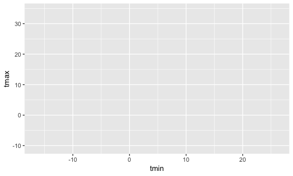

Scatterplot

``` r
ggplot(weather_df, aes(x = tmin, y = tmax))+
  geom_point()
```

    ## Warning: Removed 15 rows containing missing values (geom_point).

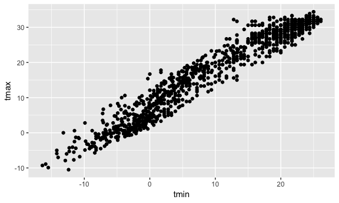

Scatterplot for a part of the data

``` r
weather_df %>% 
  filter(name == "CentralPark_NY") %>% 
  ggplot(aes(x = tmin, y = tmax)) +
  geom_point()
```

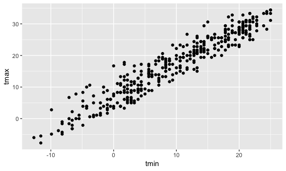

Name the scatterplot

``` r
weather_sp =
  ggplot(weather_df, aes(x = tmin, y = tmax)) +
  geom_point()
```

More plot options
-----------------

``` r
ggplot(weather_df, aes(x = tmin, y = tmax)) +
  geom_point(aes(color = name))
```

    ## Warning: Removed 15 rows containing missing values (geom_point).


Add a geom\_smooth

``` r
ggplot(weather_df, aes(x = tmin, y = tmax)) +
  geom_point(aes(color = name)) +
  geom_smooth()
```

    ## `geom_smooth()` using method = 'gam' and formula 'y ~ s(x, bs = "cs")'

    ## Warning: Removed 15 rows containing non-finite values (stat_smooth).

    ## Warning: Removed 15 rows containing missing values (geom_point).

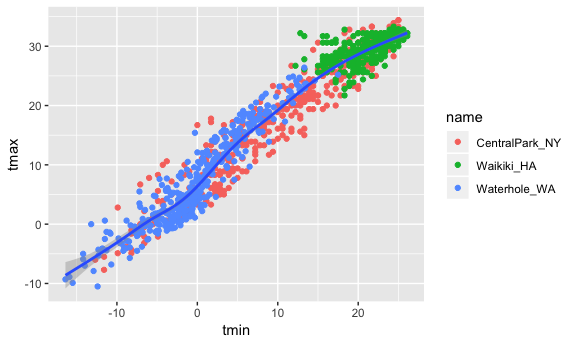

Add a geom\_smooth which there is no confidence interval around smooth

``` r
ggplot(weather_df, aes(x = tmin, y = tmax)) +
  geom_point(aes(color = name)) +
  geom_smooth(se = FALSE)
```

    ## `geom_smooth()` using method = 'gam' and formula 'y ~ s(x, bs = "cs")'

    ## Warning: Removed 15 rows containing non-finite values (stat_smooth).

    ## Warning: Removed 15 rows containing missing values (geom_point).

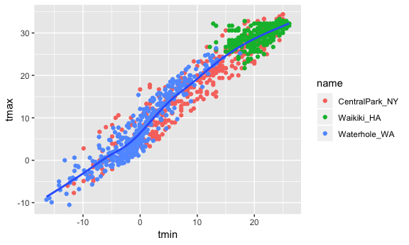

Add a geom with alpha = 0.4

``` r
ggplot(weather_df, aes(x = tmin, y = tmax)) +
  geom_point(aes(color = name), alpha = 0.4) +
  geom_smooth(se = FALSE)
```

    ## `geom_smooth()` using method = 'gam' and formula 'y ~ s(x, bs = "cs")'

    ## Warning: Removed 15 rows containing non-finite values (stat_smooth).

    ## Warning: Removed 15 rows containing missing values (geom_point).

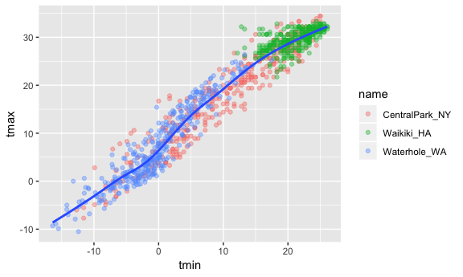

Add a geom with point and smooth colored by name

``` r
ggplot(weather_df, aes(x = tmin, y = tmax, color = name)) +
  geom_point(alpha = 0.4) +
  geom_smooth(se = FALSE)
```

    ## `geom_smooth()` using method = 'loess' and formula 'y ~ x'

    ## Warning: Removed 15 rows containing non-finite values (stat_smooth).

    ## Warning: Removed 15 rows containing missing values (geom_point).

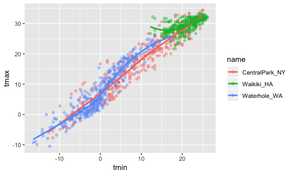

can also colored by prcp

``` r
ggplot(weather_df, aes(x = tmin, y = tmax, color = prcp)) +
  geom_point(alpha = 0.4) 
```

    ## Warning: Removed 15 rows containing missing values (geom_point).

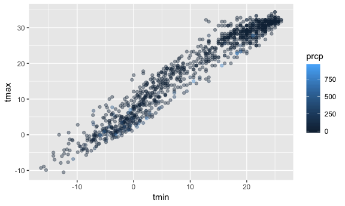

Facetting with name

``` r
ggplot(weather_df, aes(x = tmin, y = tmax, color = name)) +
  geom_point(alpha = 0.4) +
  geom_smooth(se = FALSE) +
  facet_grid( ~ name)
```

    ## `geom_smooth()` using method = 'loess' and formula 'y ~ x'

    ## Warning: Removed 15 rows containing non-finite values (stat_smooth).

    ## Warning: Removed 15 rows containing missing values (geom_point).

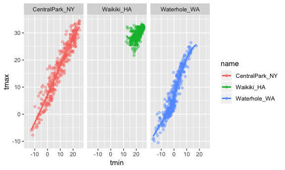

A more interesting plot

change the x and y aes

``` r
ggplot(weather_df, aes(x = date, y = tmax, color = name)) +
  geom_point()
```

    ## Warning: Removed 3 rows containing missing values (geom_point).

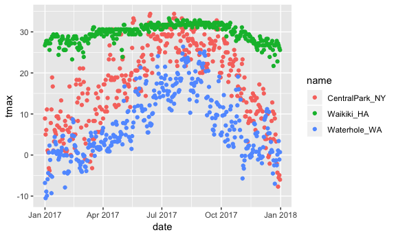

``` r
ggplot(weather_df, aes(x = date, y = tmax, color = name)) +
  geom_line()
```

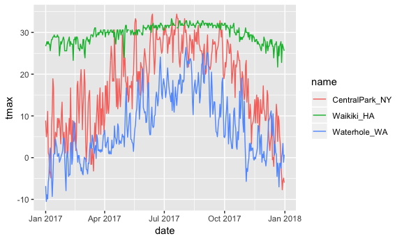

add "size"

``` r
ggplot(weather_df, aes(x = date, y = tmax, color = name, size = prcp)) +
  geom_point()
```

    ## Warning: Removed 3 rows containing missing values (geom_point).

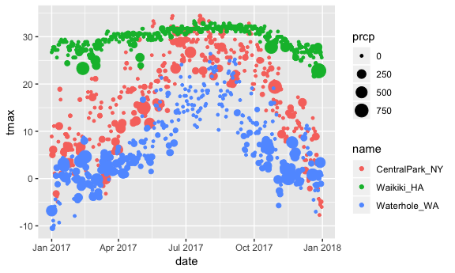

altogether

``` r
ggplot(weather_df, aes(x = date, y = tmax, color = name, size = prcp)) +
  geom_point() +
  geom_smooth(se = FALSE) +
  facet_grid( ~ name)
```

    ## `geom_smooth()` using method = 'loess' and formula 'y ~ x'

    ## Warning: Removed 3 rows containing non-finite values (stat_smooth).

    ## Warning: Removed 3 rows containing missing values (geom_point).

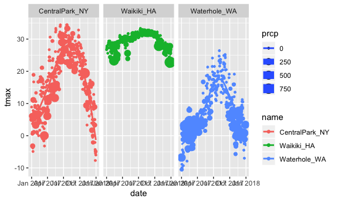

keep in mind of the differences between these two:

``` r
ggplot(weather_df) + geom_point(aes(x = tmax, y = tmin), color = "blue")  # true
```

    ## Warning: Removed 15 rows containing missing values (geom_point).

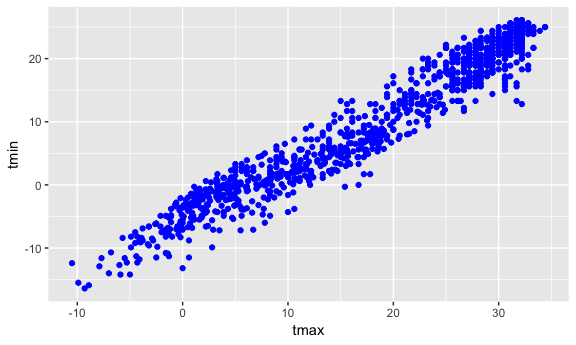

``` r
ggplot(weather_df) + geom_point(aes(x = tmax, y = tmin, color = "blue"))  # flase
```

    ## Warning: Removed 15 rows containing missing values (geom_point).

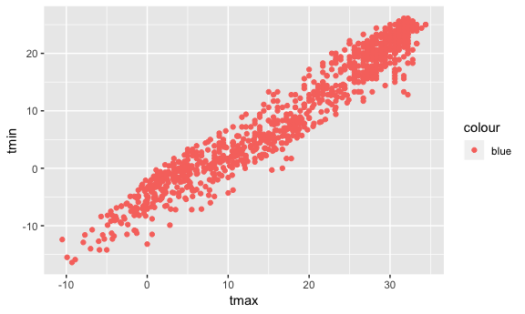

Univariate plots
----------------

Histograms!!

``` r
ggplot(weather_df, aes(x = tmax)) +
  geom_histogram()
```

    ## `stat_bin()` using `bins = 30`. Pick better value with `binwidth`.

    ## Warning: Removed 3 rows containing non-finite values (stat_bin).

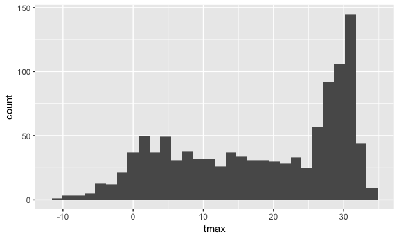

``` r
ggplot(weather_df, aes(x = tmax)) +
  geom_histogram() +
  facet_grid(~name)
```

    ## `stat_bin()` using `bins = 30`. Pick better value with `binwidth`.

    ## Warning: Removed 3 rows containing non-finite values (stat_bin).

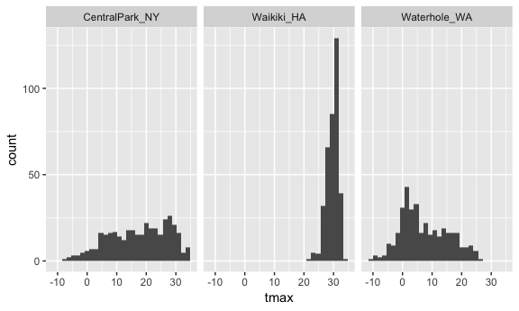

``` r
ggplot(weather_df, aes(x = tmax, fill = name)) +
  geom_histogram()
```

    ## `stat_bin()` using `bins = 30`. Pick better value with `binwidth`.

    ## Warning: Removed 3 rows containing non-finite values (stat_bin).

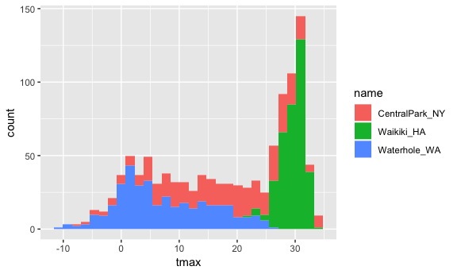

Density

``` r
ggplot(weather_df, aes(x = tmax, fill = name)) +
  geom_density(alpha = 0.5)
```

    ## Warning: Removed 3 rows containing non-finite values (stat_density).

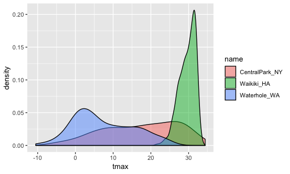

Boxplot!!

``` r
ggplot(weather_df, aes(x = name, y = tmax)) +
  geom_boxplot()
```

    ## Warning: Removed 3 rows containing non-finite values (stat_boxplot).

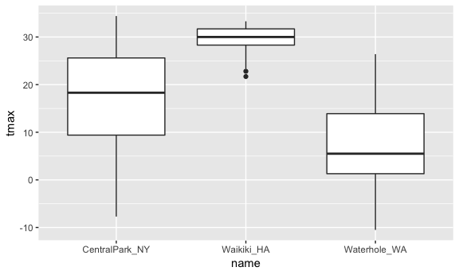

Violin plot!

``` r
ggplot(weather_df, aes(x = name, y = tmax)) +
  geom_violin()
```

    ## Warning: Removed 3 rows containing non-finite values (stat_ydensity).

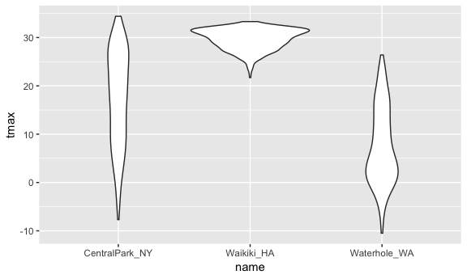

density ridges!

``` r
ggplot(weather_df, aes(x = tmax, y = name)) +
  geom_density_ridges()
```

    ## Picking joint bandwidth of 1.84

    ## Warning: Removed 3 rows containing non-finite values (stat_density_ridges).

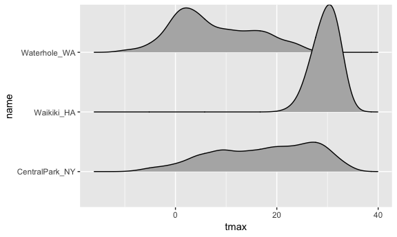

``` r
ggplot(weather_df, aes(x = prcp, y = name)) + 
  geom_density_ridges(scale = .85)
```

    ## Picking joint bandwidth of 4.61

    ## Warning: Removed 3 rows containing non-finite values (stat_density_ridges).

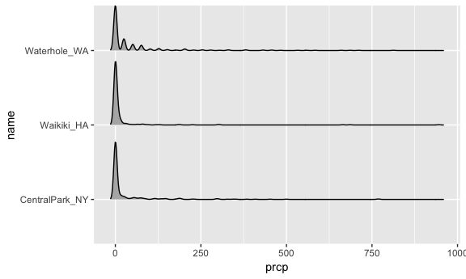

``` r
weather_plot = ggplot(weather_df, aes(x = tmin, y = tmax)) + 
  geom_point(aes(color = name), alpha = .5) 

ggsave("weather_plot.pdf", weather_plot, width = 8, height = 5)
```

    ## Warning: Removed 15 rows containing missing values (geom_point).

Last example
------------

Make plots that compare precipitation across locations:

Open question! need to make a lot of plots

Try a histogram, a density plot, a boxplot, a violin plot, and a ridgeplot; use aesthetic mappings to make your figure readable.

Make a bunch of plots!

``` r
# not as good, since long tail
ggplot(weather_df, aes(y = prcp, x = name))+
  geom_boxplot()
```

    ## Warning: Removed 3 rows containing non-finite values (stat_boxplot).

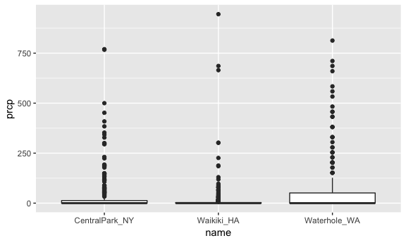

``` r
# even wrose
ggplot(weather_df, aes(y = prcp, x = name))+
  geom_violin()
```

    ## Warning: Removed 3 rows containing non-finite values (stat_ydensity).

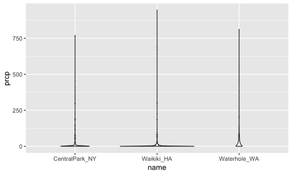

``` r
# not usful
ggplot(weather_df, aes(x = prcp, fill = name))+
  geom_density(alpha = .5)
```

    ## Warning: Removed 3 rows containing non-finite values (stat_density).

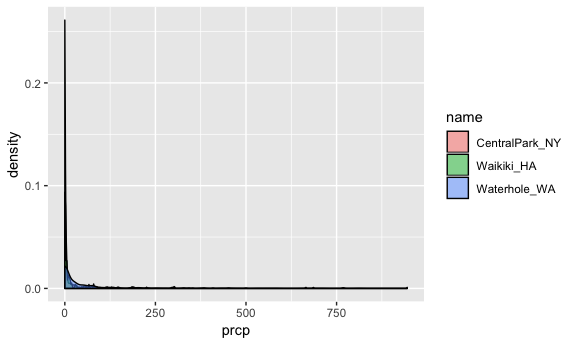

``` r
# still skewd
weather_df %>% 
  filter(prcp <100) %>% 
  ggplot(aes(x = prcp, fill = name))+
  geom_density(alpha = .5)
```

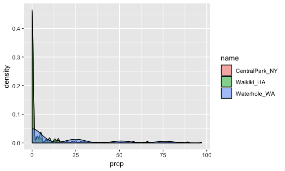

``` r
# 
weather_df %>% 
  filter(prcp > 0) %>% 
  ggplot(aes(x = prcp, fill = name))+
  geom_density(alpha = .5)
```

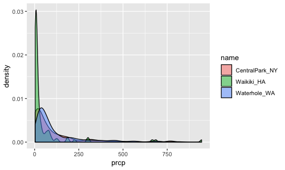
